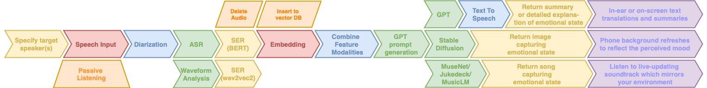
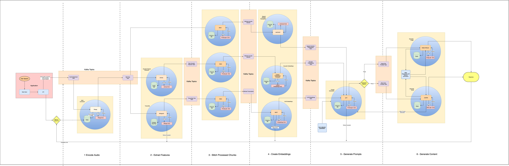
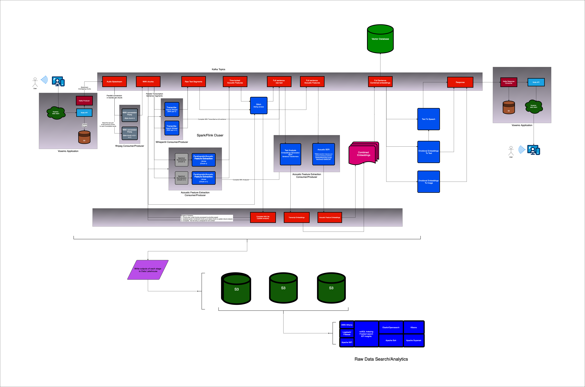

# Voxemo
Real-time sentiment analyzer and reflective content generator
## Overview

Voxemo extracts and translates emotional sentiment across multiple modalities in real time. It generates visual or musical artwork from audio sources and provides explanations and summaries of emotional content.

It functions as a two-way emotional translator and expressive instrument, converting speech into artwork that reflects the speaker's emotional state. It also offers verbal explanations and summaries of the sentiment and intent behind a statement.

### Key Use Cases

- **Communication Assistance**: Helps individuals with social-cognitive impairments, speech aphasia, or those on the autism spectrum to better express emotions and understand others.
- **Enhanced Communication**: Enables real-time note summarization and rephrasing of sentences for clearer, more effective communication.
- **Daily Activity Summaries**: Provides summaries of daily activities by passively listening or tracking user location (with consent), overlaying key points on a map, and providing contextual metadata. It can also send alerts to help users avoid negative emotional states based on learned triggers.

## Design Approach

Voxemo prioritizes speed and efficiency in processing emotional data, with a robust architecture designed for real-time responsiveness.

### System Architecture

- **Client Application (Next.js/React)**: 
  - Captures audio input using the Web Recorder API.
  - Streams raw byte data to the Node.js API server in real time.

- **API Server (Node.js)**:
  - Receives the audio byte stream from the client.
  - Immediately forwards the stream to a Kafka topic named bytestream.

- **Kafka Bytestream Consumer (chunks_2wav)**:
  - Processes the audio data into WAV file chunks.
  - Sends small WAV files containing sentence fragments to the wav_2whisper Kafka topic.

- **Kafka Whisper Consumer (wav_2whisper)**:
  - Processes WAV files with the Whisper ASR (Automatic Speech Recognition) API.
  - Receives transcriptions and forwards them for sentence reconstruction.

- **Paralinguistic/Acoustic Feature Extraction**:
  - Utilizes advanced techniques to analyze emotional content from audio inputs.

<!--  -->

### Additional Technologies

- **Large Language Models (LLM)**:
  - Interprets, generates, and responds to emotional content extracted from voice inputs, facilitating contextual understanding and expressive content generation.

- **Text-to-Speech (TTS)**:
  - Converts generated text responses into natural-sounding speech, providing real-time auditory feedback.

### Resources

- [Towards Paralinguistic-Only Speech Representations for End-to-End Speech Emotion Recognition](https://assets.amazon.science/21/f3/1496cf78467399381a6e8bf0ae47/towards-paralinguistic-only-speech-representations-for-end-to-end-speech-emotion-recognition.pdf)